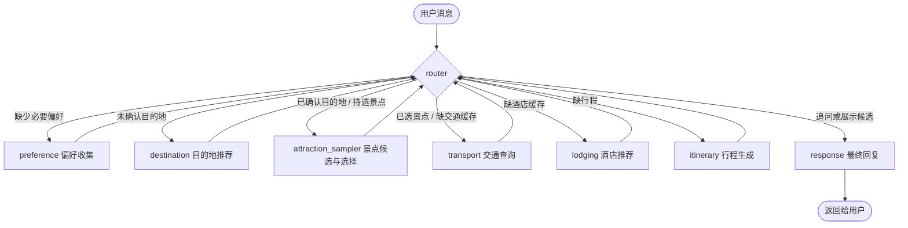

# Lingcheng 灵程 — 智能旅游规划 Agent

> 多轮对话 · 增量偏好调整 · 思考链路可视化

**灵程(Lingcheng)**是一个基于 **LangGraph + 阿里百炼** 的智能旅行规划助手。它通过自然语言聊天，逐步收集你的目的地、天数、预算、节奏等偏好，再综合查询交通（高铁/机票）和酒店景点信息，自动生成完整的每日行程攻略。你可以随时说"改成豪华版""缩短到3天""换成高铁"，Agent 会增量调整而不是重头再来。

---

## ✨ 亮点

- 🗣️ 多轮对话：像和朋友聊天一样规划旅行
- 🚆 实时价格：高铁班次与票价（12306 MCP）+ 机票比价（百炼搜索）
- 🏨 智能推荐：酒店、景点、餐饮，符合你的节奏和预算
- 🔄 增量调整：说“改成豪华版”或“缩短到3天”，Agent 自动重新规划
- 🧠 思考可见：每一步决策过程都展示给你

---

## 功能特性

- **多轮对话偏好收集**：自然友好地追问缺失信息，一次最多 1–2 个问题。
- **目的地推荐与确认**：根据偏好推荐 1–3 个目的地及理由，等待用户确认。
- **交通查询**：高铁走 12306 MCP（当前 Mock，含真实接入说明），机票走百炼联网搜索 MCP（当前 Mock）。
- **酒店与景点推荐**：基于预算等级返回 Mock 数据（覆盖北京/上海/杭州/成都/西安）。
- **行程生成**：LLM 生成 Markdown 每日行程（上午/下午/晚上 + 餐饮）。
- **增量调整**：检测到偏好变化时，只重跑受影响的节点。
- **思考链路展示**：每条回复带 `<details>` 折叠块，展示 Agent 内部决策步骤。

---

## 🛠️ 技术栈

- LangGraph — 状态机与多轮记忆
- 阿里百炼 — LLM 推理 + 联网搜索
- MCP 协议 — 12306 高铁数据
- Gradio — Web 对话界面

---

## 架构图



每个非 `response` 节点结束后都会重新进入 `router` 重新评估；`attraction_sampler` 在用户确认目的地之后、交通/酒店/行程之前运行，生成 6–8 个候选景点并等待用户选择 2–3 个（支持「换一批」「换个城市」），选中后再进入 `transport`。

---

## 目录结构

```
.
├── .env.example              环境变量模版（复制为 .env 后填写）
├── requirements.txt          Python 依赖
├── run.py                    统一启动脚本
├── README.md                 本文件
├── src/
│   ├── agent/
│   │   ├── graph.py          LangGraph 编排
│   │   ├── state.py          AgentState 定义
│   │   ├── llm.py            qwen-max 客户端封装
│   │   ├── nodes/            7 个节点（preference / destination / attraction_sampler / transport / lodging / itinerary / response）
│   │   └── tools/            外部工具（mcp_12306 / web_search / mock_data / flyai_api）
│   └── ui/
│       └── gradio_app.py     Gradio 聊天界面
└── tests/                    （占位）
```

---

## 安装与运行

### 1) 创建并激活虚拟环境（venv）

> 本项目约定虚拟环境必须在根目录、文件夹名为 `venv`。

**Windows PowerShell：**

```powershell
python -m venv venv
.\venv\Scripts\Activate.ps1
```

**Windows CMD：**

```cmd
python -m venv venv
.\venv\Scripts\activate.bat
```

**macOS / Linux：**

```bash
python -m venv venv
source venv/bin/activate
```

激活后命令行前应出现 `(venv)` 前缀。

### 2) 安装依赖

```bash
pip install -U pip
pip install -r requirements.txt
```

### 3) 配置 API Key

```bash
# Windows PowerShell
Copy-Item .env.example .env
# macOS / Linux
cp .env.example .env
```

编辑 `.env`，将 `DASHSCOPE_API_KEY=` 后面填入你在 [阿里百炼控制台](https://dashscope.console.aliyun.com/) 申请的 Key。

### 4) 启动

```bash
python run.py
```

启动成功后浏览器打开 <http://127.0.0.1:7860> 即可对话。

---

## Mock 数据 / MCP 接入说明

为了让项目"开箱即跑"，下述外部工具当前默认走 Mock：

| 工具 | 当前实现 | 真实接入指引（已在源文件顶部注释） |
| --- | --- | --- |
| 12306 高铁查询 | `src/agent/tools/mcp_12306.py` 中的 Mock 车次 | 通过 `subprocess.Popen(["npx", "-y", "12306-mcp"], …)` 启动 MCP server，按 JSON-RPC `initialize → tools/list → tools/call` 三步握手调用 |
| 百炼联网搜索（机票/通用搜索） | `src/agent/tools/web_search.py` 中的 Mock 航班 | 在百炼控制台启用"联网搜索"工具，使用 `tools=[{"type": "mcp", ...}]` 参数传给 `chat.completions` |
| 飞猪酒店/景点 | `src/agent/tools/mock_data.py` 静态数据 | 接入 flyai 后替换 `get_hotels` / `get_attractions` 实现 |

切换到真实实现时，只需替换对应函数体即可，节点层无需改动。

---

## 常见问题

- **报 `DASHSCOPE_API_KEY` 缺失**：请确认 `.env` 已存在，并且通过 `python run.py` 启动（脚本会自动 `load_dotenv`）。
- **模型很慢/报错**：可在 `.env` 中把 `QWEN_MODEL` 改成 `qwen-plus` 或 `qwen-turbo`。
- **Gradio 端口占用**：修改 `.env` 里的 `GRADIO_PORT`。

---

## License

MIT，详见 `LICENSE`。
